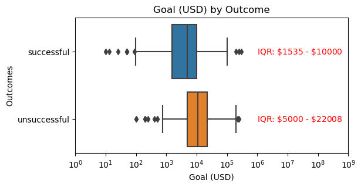

# Kickstarter Campaign Strategy

## **Introduction**

Kickstarter has become a crucial platform for funding creative projects. However, achieving success on this platform requires a solid understanding of various factors such as campaign goals, backer behavior, and market trends. Our client, a small board game company, is looking to launch their first Kickstarter campaign with a minimum goal of $15,000 USD. Our objective is to determine a realistic fundraising goal, estimate the number of backers needed, and predict the likely number of backers based on industry trends. The analysis was carried out using SQL queries on Kickstarter campaign data, focusing on campaign goals, number of backers, and campaign durations.

## Methods

1. **Data Cleaning**: We excluded 'live' campaigns, as their outcomes were yet to be determined. We also categorized 'failed', 'canceled', 'suspended', and 'undefined' campaigns as unsuccessful for clarity in comparison against successful campaigns. The regression analysis of campaign duration and funds raised only considered successful campaigns, as including unsuccessful campaigns would have violated the assumptions for regression analysis. It is worth noting that many unsuccessful campaigns generated minimal or no funds.
2. **Standardization**: We standardized currency units to USD using historical currency exchange rates. Historical rates were collected from [CurrencyBeacon.com](http://CurrencyBeacon.com) using their API. This was essential to ensure consistency and accuracy in our analysis, particularly when comparing campaigns across different countries. We added the currency exchange rates to the dataset as a table called "currency". Additionally, we applied a log-transformation to the funds raised in the regression analysis in order to meet the assumptions of the model.

## Preliminary Analysis

1. **Campaign Goals and Success Rate**: Unsuccessful campaigns typically set higher fundraising goals with a median of $11,000 (IQR $5,000-$22,000) compared to successful ones with a median of $1,534 (IQR $4059-$10,000) (**Figure 1**).
2. **Backer Trends**: The three categories with the highest number of backers were Games (41,180), Technology (329,467), and Design (261,270). On the other hand, the three categories with the lowest number of backers were Dance (6,022), Journalism (6,206), and Crafts (10,383). Among the subcategories, Tabletop Games (246,644), Product Design (220,982), and Video Games (141,048) had the most backers (**Figure 1**). In contrast, the subcategories with the fewest backers were Latin (13), Photo (12), and Glass (2). Within the Games category, which includes board games, there was a significant variation in the number of backers for each subcategory, with Tabletop Games attracting the most backers.
3. **Fundraising Trends**: The three categories that raised the highest amount of funds were Games ($29.03M), Technology ($28.05M), and Design ($26.3M). On the other hand, the three categories that raised the lowest amount of funds were Journalism ($449.73K), Dance ($511.77K), and Crafts ($608.15K). When it comes to subcategories, the top three in terms of funds raised were Product Design ($23.05M), Tabletop Games ($19.66M), and Video Games ($7.91M) (see **Figure 2**). Conversely, the three subcategories with the lowest funds raised were Glass ($150), Crochet ($255), and Latin ($268).
4. ********Most Successful Campaign********: The most successful board game, 'Gloomhaven', raised around $4M with 40,642 backers. 
5. **Geographical Pattern**: The United States led with $100.92M pledged across 4364 campaigns, the United Kingdom with $5.58M across 487 campaigns, and Canada with $2.27M across 137 campaigns (**Figure S1**). This pattern suggests that Kickstarter campaigns have a track record of being successful fundraisers in these countries.
6. **Campaign Duration and Funds Raised**: There is a weak correlation between campaign length and money raised (**Figure S2**, R^2 = 0.0217, β =0.0082), suggesting that fundraising success is less about duration and more about other features of the campaign.

## **Data Visualizations**

**Figure 1.** This box plot illustrates the distribution of campaign goals across different outcomes. Successful campaigns generally had lower goals than unsuccessful ones, emphasizing the need for realistic target setting. 

**Figure 2.** This bar chart shows the number of backers per subcategory highlighting the popularity of campaigns within different segments. Tabletop games, product design, and video games received the highest backer counts, indicating an optimistic potential for our board game’s Kickstarter campaign. 

**Figure 3.** Similar to backers by category, this bar chart provides a visual comparison of funds raised across different categories. Product design campaigns topped the fundraising with $23.05M, followed by tabletop games at $19.66M, and video games at $7.91M. Our Kickstarter campaigns falls under one of the top performed subcategories, demonstrating strong fundraising potential.

**************Figure 4.************** This box plot shows the distribution of pledged funds (USD) for successful Tabletop Game campaigns in the US, UK, and Canada. Canada led with the highest median of $21,020 raised per campaign, followed by US with a median of $11,493, and finally followed by UK with a median of $6,713. These ranges of pledged funds for successful Tabletop Game campaigns serve as references for realistic fundraising targets for a successful campaign in these three geographical markets.

**Figure 5.** This box plot shows the distribution of the number of backers for successful Tabletop Game campaigns in the US, UK, and Canada. The US led with the highest median of 242 backers, followed by UK with a median of 187 backers, and finally followed by Canada with a median of 184 backers. These ranges of the number of backers for successful Tabletop Game campaigns provide a benchmark of the number of backers we can expect if we launch in each of these geographical markets.

## **Recommendations**

1. **Realistic Fundraising Goal**: Considering the trends, a goal of $15,000 is ambitious but achievable. This campaign goal exceeds the 75% IQR ($10,000) for successful campaigns (**Figure 1**) but falls within the typical range of funds raised in successful American , British, and Canadian tabletop game campaigns (**Figure 4**).
2. **Backer Estimates**: Combining the funds raised and the number of backers for tabletop games (**Figure 2, 3**), we estimate that on average each backer may pledge ~$80. To meet a $15,000 goal, the campaign would need approximately 200 backers.
3. **Expected Number of Backers**: If we launch the Kickstarter campaign in one of the top three countries with the most successful campaigns—the US, UK, and Canada—we can expect a minimum of 90 backers up to a reasonable maximum of 700, 500, and 300 for the US, Canada, and UK, respectively (**Figure 5**). Therefore, to maximize our potential for a successful Kickstarter campaign, we recommend our client to launch the campaign in the US market, where the expected number of backers is highest.

[Supplmental figures](supplemental_figures.md)