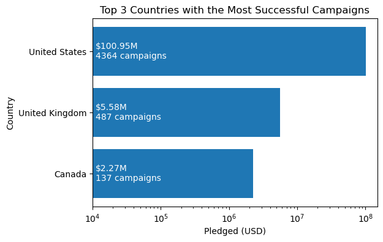
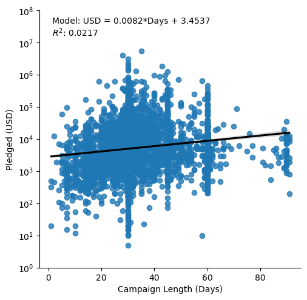

# Supplemental Figures

**Figure S1.** This bar chart ranks the top three countries by the number of successful tabletop game campaigns and total funds pledged. 

**Figure S2.** This scatter plot shows that the correlation between campaign length and funds raised was minimal (R2 = 0.02) with a regression coefficient (β =0.0082) indicating a very weak positive trend.
